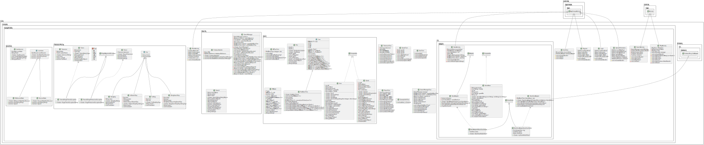

# [G62 - Group 62] Report

## Table of Contents

1. [Team Members and Roles](#team-members-and-roles)
2. [Summary of Individual Contributions](#summary-of-individual-contributions)
3. [Application Description](#application-description)
4. [Application UML](#application-uml)
5. [Application Design and Decisions](#application-design-and-decisions)
6. [Summary of Known Errors and Bugs](#summary-of-known-errors-and-bugs)
7. [Testing Summary](#testing-summary)
8. [Implemented Features](#implemented-features)
9. [Team Meetings](#meetings-records)
10. [Conflict Resolution Protocol](#conflict-resolution-protocol)

## Administrative
- Firebase Repository Link: <https://console.firebase.google.com/u/0/project/gp-24s1-c13fc/overview?hl=zh-cn>
   - Confirm: I have already added comp21006442@gmail.com as a Developer to the Firebase project prior to due date.
- Two user accounts for markers' access are usable on the app's APK:
   - Username: comp2100@anu.edu.au	Password: comp2100
   - Username: comp6442@anu.edu.au	Password: comp6442

## Team Members and Roles
The key area(s) of responsibilities for each member

| UID      |     Name      |      Role |
|:---------|:-------------:|----------:|
| u7757596 | Jinqiao Jiang | Developer |
| u7178864 |   Jin Zhang   | Developer |
| u7643012 | Xinyue Huang  | Developer |
| u7775048 | Dong-Jhang Wu | Developer |
| u7741198 |  Jessica Lai  | Developer |

## Summary of Individual Contributions

Specific details of individual contribution of each member to the project.

1. **u7757596, Jinqiao Jiang**  I have 20% contribution, as follows:  
- **Code Contribution in the final App**
    - Data Structure used to store Datafiles from firebase - class RedBlackTree: [RedBlackTree.java](https://gitlab.cecs.anu.edu.au/u7757596/gp-24s1/-/blob/main/src/app/src/main/java/com/example/myapplication/Java/RedBlackTree.java), class Pair: [Pair.java](https://gitlab.cecs.anu.edu.au/u7757596/gp-24s1/-/blob/main/src/app/src/main/java/com/example/myapplication/Java/Pair.java), class RBNode: [RBNode.java](https://gitlab.cecs.anu.edu.au/u7757596/gp-24s1/-/blob/main/src/app/src/main/java/com/example/myapplication/Java/RBNode.java), class Tree: [Tree.java](https://gitlab.cecs.anu.edu.au/u7757596/gp-24s1/-/blob/main/src/app/src/main/java/com/example/myapplication/Java/Tree.java)
    - Template Design Pattern - class Tree: [Tree.java](https://gitlab.cecs.anu.edu.au/u7757596/gp-24s1/-/blob/main/src/app/src/main/java/com/example/myapplication/Java/Tree.java), function [insert()](https://gitlab.cecs.anu.edu.au/u7757596/gp-24s1/-/blob/main/src/app/src/main/java/com/example/myapplication/Java/Tree.java?ref_type=heads#L32), function [delete()](https://gitlab.cecs.anu.edu.au/u7757596/gp-24s1/-/blob/main/src/app/src/main/java/com/example/myapplication/Java/Tree.java?ref_type=heads#L33)
    - Search methods in class [RedBlackTree.java](https://gitlab.cecs.anu.edu.au/u7757596/gp-24s1/-/blob/main/src/app/src/main/java/com/example/myapplication/Java/RedBlackTree.java): findUserById(), findGoodById(), findGoodsByUser(), findGoodsByGoodName(), findGoodsByPriceCondition(), findGoodsByCoordinatesCondition()   
    - DataDeletion is implemented for RB tree in class [RedBlackTree.java](https://gitlab.cecs.anu.edu.au/u7757596/gp-24s1/-/blob/main/src/app/src/main/java/com/example/myapplication/Java/RedBlackTree.java): delete().  This deletion serves the purpose that user can delete their goods after exchange.

- **Code and App Design**
    - Template Patterns and Red Black Tree data structure is proposed by this member*

- **Others**: 
    - Report writing for the UML, design and data structure part
    - comments, implements Comparator in class [User.java](https://gitlab.cecs.anu.edu.au/u7757596/gp-24s1/-/blob/main/src/app/src/main/java/com/example/myapplication/Java/User.java) and class[Goods.java](https://gitlab.cecs.anu.edu.au/u7757596/gp-24s1/-/blob/main/src/app/src/main/java/com/example/myapplication/Java/Goods.java)

2. **u7775048, Dong-Jhang, Wu**  I have 20% contribution, as follows:  
- **Code Contribution in the final App**
    - Tokenizer and Parser: [TokenizerParser](..%2Fsrc%2Fapp%2Fsrc%2Fmain%2Fjava%2Fcom%2Fexample%2Fmyapplication%2FTokenizerParser)
    - Part of search -  class Search: [Search.java](..%2Fsrc%2Fapp%2Fsrc%2Fmain%2Fjava%2Fcom%2Fexample%2Fmyapplication%2FSearch%2FSearch.java), Search Manager: [SearchManager.java](..%2Fsrc%2Fapp%2Fsrc%2Fmain%2Fjava%2Fcom%2Fexample%2Fmyapplication%2FSearch%2FSearchManager.java)
    - Part of unit test - [TokenizerTest.java](..%2Fsrc%2Fapp%2Fsrc%2Ftest%2Fjava%2Fcom%2Fexample%2Fmyapplication%2FTokenizerTest.java), [SearchManagerTest.java](..%2Fsrc%2Fapp%2Fsrc%2Ftest%2Fjava%2Fcom%2Fexample%2Fmyapplication%2FSearchManagerTest.java), [ParserTest.java](..%2Fsrc%2Fapp%2Fsrc%2Ftest%2Fjava%2Fcom%2Fexample%2Fmyapplication%2FParserTest.java)

- **Code and App Design**
    - Tokenizer and Parser: the grammar design is proposed by this member
    - Implement the search function using a Search Manager Singleton pattern.

- **Others**: 
    - Report writting for the Tokenizer and Parser and singleton pattern.

3. **u7643012, Xinyue Huang** I have 20% contribution, as follows:
- **Code Contribution in the final App**
    - Goods and User: [Goods](https://gitlab.cecs.anu.edu.au/u7757596/gp-24s1/blob/4b2d4fd3efe2b4d204241329a1fe6d30ee3fb331/src/app/src/main/java/com/example/myapplication/Java/Goods.java) and [User](https://gitlab.cecs.anu.edu.au/u7757596/gp-24s1/blob/4b2d4fd3efe2b4d204241329a1fe6d30ee3fb331/src/app/src/main/java/com/example/myapplication/Java/User.java)
    - Part of unit test - [GoodsTest.java](https://gitlab.cecs.anu.edu.au/u7757596/gp-24s1/blob/1145d1f209b434914269833e41594773ef6c0c12/src/app/src/test/java/com/example/myapplication/GoodsTest.java), [RBTreeTest.java](https://gitlab.cecs.anu.edu.au/u7757596/gp-24s1/blob/8e2bdbe309a8639867463827667c050f94c01c88/src/app/src/test/java/com/example/myapplication/RBTreeTest.java), [UserTest.java](https://gitlab.cecs.anu.edu.au/u7757596/gp-24s1/blob/f47f1a3e20b3980ec108e282acec5a1704f5aef0/src/app/src/test/java/com/example/myapplication/UserTest.java)
- **Code and App Design**
    - Goods class and User class: The most basic data format in the app is the link between data and algorithms. Data from the database is converted into these two types of data before being used in other algorithms.
- **Others**: 
    - Wrote the testing and bug logging portion of the report.

4.  **u7741198, Jessica Lai**  I have 20% contribution, as follows:  
- **Code Contribution in the final App**
    - Login and Register: [Login.java](https://gitlab.cecs.anu.edu.au/u7757596/gp-24s1/-/blob/main/src/app/src/main/java/com/example/myapplication/Login.java?ref_type=heads)
                         [Register.java](https://gitlab.cecs.anu.edu.au/u7757596/gp-24s1/-/blob/main/src/app/src/main/java/com/example/myapplication/Register.java?ref_type=heads)
    - part of MainActivity: [MainActivity.java](https://gitlab.cecs.anu.edu.au/u7757596/gp-24s1/-/blob/main/src/app/src/main/java/com/example/myapplication/MainActivity.java?ref_type=heads)
    - part of UsersBean: [UsersBean.java](https://gitlab.cecs.anu.edu.au/u7757596/gp-24s1/-/blob/main/src/app/src/main/java/com/example/myapplication/ui/adapter/UsersBean.java?ref_type=heads)
    - StoreUserAdapter [StoreUserAdapter.java](https://gitlab.cecs.anu.edu.au/u7757596/gp-24s1/-/blob/main/src/app/src/main/java/com/example/myapplication/ui/adapter/StoreUserAdapter.java?ref_type=heads)
    - UploadInformation: [UploadInformation.java](https://gitlab.cecs.anu.edu.au/u7757596/gp-24s1/-/blob/main/src/app/src/main/java/com/example/myapplication/UploadInformation.java?ref_type=heads)
    - UserView: [UserView.java](https://gitlab.cecs.anu.edu.au/u7757596/gp-24s1/-/blob/main/src/app/src/main/java/com/example/myapplication/UserView.java?ref_type=heads)
    - UI: [activity_login.xml](https://gitlab.cecs.anu.edu.au/u7757596/gp-24s1/-/blob/main/src/app/src/main/res/layout/activity_login.xml?ref_type=heads)
          [activity_register.xml](https://gitlab.cecs.anu.edu.au/u7757596/gp-24s1/-/blob/main/src/app/src/main/res/layout/activity_register.xml?ref_type=heads)
          [activity_upload_information.xml](https://gitlab.cecs.anu.edu.au/u7757596/gp-24s1/-/blob/main/src/app/src/main/res/layout/activity_upload_information.xml?ref_type=heads)
          [activity_user_view.xml](https://gitlab.cecs.anu.edu.au/u7757596/gp-24s1/-/blob/main/src/app/src/main/res/layout/activity_user_view.xml?ref_type=heads)
          [storeuser_item.xml](https://gitlab.cecs.anu.edu.au/u7757596/gp-24s1/-/blob/main/src/app/src/main/res/layout/storeuser_item.xml?ref_type=heads)
    - part of UI: [activity_main.xml](https://gitlab.cecs.anu.edu.au/u7757596/gp-24s1/-/blob/main/src/app/src/main/res/layout/activity_main.xml?ref_type=heads)
    - part of Data file: [merged_data.json](https://gitlab.cecs.anu.edu.au/u7757596/gp-24s1/-/blob/735ea7d81812ed22663896add089d26632eef5a2/items/merged_data.json)

5. **u7178864, Jin Zhang** I have 20% contribution, as follows:
- **Code Contribution in the final App**
    - Search and Map Activity: [Search activity.java](https://gitlab.cecs.anu.edu.au/u7757596/gp-24s1/-/blob/main/src/app/src/main/java/com/example/myapplication/SearchActivity.java?ref_type=heads) and [Map activity.java](https://gitlab.cecs.anu.edu.au/u7757596/gp-24s1/-/blob/main/src/app/src/main/java/com/example/myapplication/MapActivity.java?ref_type=heads) and [Store activity.java](https://gitlab.cecs.anu.edu.au/u7757596/gp-24s1/-/blob/main/src/app/src/main/java/com/example/myapplication/ui/adapter/StoreActivity.java?ref_type=heads) 
    - Part of search  - [SearchManager.java](..%2Fsrc%2Fapp%2Fsrc%2Fmain%2Fjava%2Fcom%2Fexample%2Fmyapplication%2FSearch%2FSearchManager.java) and [FirebaseHandler.java](https://gitlab.cecs.anu.edu.au/u7757596/gp-24s1/-/blob/main/src/app/src/main/java/com/example/myapplication/Search/FirebaseHandler.java?ref_type=heads) and [StringSearchExp.java](https://gitlab.cecs.anu.edu.au/u7757596/gp-24s1/-/blob/main/src/app/src/main/java/com/example/myapplication/TokenizerParser/StringSearchExp.java?ref_type=heads) and [IntSearchExp.java](https://gitlab.cecs.anu.edu.au/u7757596/gp-24s1/-/blob/main/src/app/src/main/java/com/example/myapplication/TokenizerParser/IntSearchExp.java?ref_type=heads) and  [RedBalckTree.java](https://gitlab.cecs.anu.edu.au/u7757596/gp-24s1/-/blob/main/src/app/src/main/java/com/example/myapplication/Java/RedBlackTree.java?ref_type=heads):provNodeListHelper(). 
    - Part of UsersBean:[User bean.java](https://gitlab.cecs.anu.edu.au/u7757596/gp-24s1/-/blob/main/src/app/src/main/java/com/example/myapplication/ui/adapter/UsersBean.java?ref_type=heads) and [Store adapter.java](https://gitlab.cecs.anu.edu.au/u7757596/gp-24s1/-/blob/main/src/app/src/main/java/com/example/myapplication/ui/adapter/StoreAdapter.java?ref_type=heads)
    - UI: [activity_search.xml](https://gitlab.cecs.anu.edu.au/u7757596/gp-24s1/-/blob/main/src/app/src/main/res/layout/activity_search.xml?ref_type=heads)
          [activity_map.xml](https://gitlab.cecs.anu.edu.au/u7757596/gp-24s1/-/blob/main/src/app/src/main/res/layout/activity_map.xml?ref_type=heads)
          [item_store.xml](https://gitlab.cecs.anu.edu.au/u7757596/gp-24s1/-/blob/main/src/app/src/main/res/layout/item_store.xml?ref_type=heads)
    - Part of UI: [activity_main.xml](https://gitlab.cecs.anu.edu.au/u7757596/gp-24s1/-/blob/main/src/app/src/main/res/layout/activity_main.xml?ref_type=heads)
    - part of Data file: [merged_data.json](https://gitlab.cecs.anu.edu.au/u7757596/gp-24s1/-/blob/735ea7d81812ed22663896add089d26632eef5a2/items/merged_data.json)
- **Code and App Design**
    - Load data and part of UI design(search and initial store list) is proposed by this member.
    - Complete search function under a Singleton pattern
- **Others**: 
    - Report writting for Application Description and part of Implemented Features
    - UML design at very beginning stage

## Application Description

GreenTrade is a second-hand marketplace application designed to facilitate the buying and selling of pre-owned items in a user-friendly and eco-conscious way. Users can create and manage their own small shops, listing items for sale and taking them down as needed. The app features a robust search function that allows users to find exactly what they need based on price range and proximity. Additionally, items available within a specified distance are displayed on a map for easy browsing.

### Application Use Cases and Examples

**GreenTrade: Second-Hand Marketplace App**

**Target Users:**
- Individuals looking to buy or sell second-hand items
- Eco-conscious consumers who prefer sustainable shopping options
- Local community members interested in reducing waste and supporting local trade

#### Use Case 1: Setting Up a Shop and Listing Items
**User**: Alex, a college student moving to a new apartment

- **Scenario**: Alex wants to sell some of his old furniture and electronics before moving.
- **Steps**:
  1. Alex downloads and registers on GreenTrade.
  2. He sets up his personal shop by adding his profile details and shop name.
  3. Alex lists his items, including a desk, a chair, and a used laptop, by uploading photos, descriptions, and setting prices.
- **Outcome**: Alex successfully sells his items to local buyers, making some extra cash and reducing the number of things he needs to move.

#### Use Case 2: Searching for Items by Price and Distance
**User**: Emily, a young professional looking for affordable home decor

- **Scenario**: Emily needs some budget-friendly decorations for her new home.
- **Steps**:
  1. Emily opens GreenTrade and navigates to the search function.
  2. She sets her price range to filter out expensive items.
  3. Emily sets a search radius of 10 miles to find items nearby.
  4. The app displays results on a map, showing various home decor items within her specified range.
  5. She selects a few items she likes and contacts the sellers to arrange purchases.
- **Outcome**: Emily finds several beautiful and affordable decor pieces, all located within a short distance from her home, making pick-up easy and cost-effective.

#### Use Case 3: Purchasing Items via the App
**User**: Mike, a recent graduate furnishing his first apartment

- **Scenario**: Mike needs to furnish his new apartment on a tight budget.
- **Steps**:
  1. Mike browses GreenTrade for essential furniture items like a bed, a table, and chairs.
  2. He filters the search results by price and distance, setting a maximum of $100 per item and a 5-mile radius.
  3. Mike finds several listings that meet his criteria and checks their details and seller ratings.
  4. He contacts the sellers to negotiate prices and arrange for pick-up.
- **Outcome**: Mike successfully furnishes his apartment with high-quality second-hand items, staying within his budget and supporting sustainable practices.

**Summary**:
GreenTrade provides a seamless platform for users to buy and sell second-hand items within their local community. With features like personal shops, advanced search functionality, and an interactive map, GreenTrade supports sustainable shopping habits and fosters a community of eco-conscious consumers.

 

### Application UML

  
*The class diagram*

## Application Design and Decisions
- Details about the parser is given in the below section
- Used data structures
  - Red Black Tree
    - good time complexity of insertion, deletion and search
  - ArrayList
    - used to store temporal data to be displayed in the frontend
  - Set
    - able to store unique ids of goods of a user
- Used design patterns
  - Template Pattern
    - Abstract class Tree is written to implement
  - Singleton Pattern
    - Used in search function as we only need one instance
  - Adapter Pattern
    - able to bridge the gap between Android elements and data in the backend

### Data Structures

*We used the following data structures in the project:*

1. *Red Black Tree*
    * *Objective: used for storing user and goods information.*
    * *Code Locations: defined in [Class RedBlackTree](https://gitlab.cecs.anu.edu.au/u7757596/gp-24s1/-/blob/main/src/app/src/main/java/com/example/myapplication/Java/RedBlackTree.java)
    * *Reasons:*
        * *It is efficient in insertion, deletion, and search with a time complexity O(log2n)*

2. *ArrayList*
    * *Objective: used for storing search results and display in the frontend.*
    * *Code Locations: defined in [Class MapActivity methods onCreate and addGoodsMarker](https://gitlab.cecs.anu.edu.au/u7757596/gp-24s1/-/blob/main/src/app/src/main/java/com/example/myapplication/MapActivity.java) and [Class SearchActivity method onCreate](https://gitlab.cecs.anu.edu.au/u7757596/gp-24s1/-/blob/main/src/app/src/main/java/com/example/myapplication/SearchActivity.java) and [Class UploadInformation method onCreate](https://gitlab.cecs.anu.edu.au/u7757596/gp-24s1/-/blob/main/src/app/src/main/java/com/example/myapplication/UploadInformation.java) and [Class RedBlackTree method findGoodsByUser](https://gitlab.cecs.anu.edu.au/u7757596/gp-24s1/-/blob/main/src/app/src/main/java/com/example/myapplication/Java/RedBlackTree.java) and [Class FirebaseHandler method fetchGoodsDataAndInsertIntoSearchManager](https://gitlab.cecs.anu.edu.au/u7757596/gp-24s1/-/blob/main/src/app/src/main/java/com/example/myapplication/Search/FirebaseHandler.java) and [Class SearchManager methods resetListAfterSearch, setSearchArrayList, getSearchArrayList, addSearchString, searchingResult, performQuery, search](https://gitlab.cecs.anu.edu.au/u7757596/gp-24s1/-/blob/main/src/app/src/main/java/com/example/myapplication/Search/SearchManager.java) and [Class StoreUserAdapter method loadDataAndCreateTree](https://gitlab.cecs.anu.edu.au/u7757596/gp-24s1/-/blob/main/src/app/src/main/java/com/example/myapplication/ui/adapter/StoreUserAdapter.java) 
    * *Reasons:*
        * *We don't need to insert or delete items in the list because we only use this data structure to display data in the frontend*

3. *Set*
    * *Objective: used for storing goods ids*
    * *Code Locations: defined in [Class User](https://gitlab.cecs.anu.edu.au/u7757596/gp-24s1/-/blob/main/src/app/src/main/java/com/example/myapplication/Java/User.java);
    * *Reasons:*
        * *In our code design, we assign a group of ids to each user to represent the goods they have*
        * Since the id is identical in our design, by using set data structure we can avoid adding two goods with the same id*

### Design Patterns
*[What design patterns did your team utilise? Where and why?]*

1. *Template Pattern*
   * *Objective: In order to bridge the gap between UI components in Android and data sources.*
   * *Code Locations: defined in [Class RedBlackTree](https://gitlab.cecs.anu.edu.au/u7757596/gp-24s1/-/blob/main/src/app/src/main/java/com/example/myapplication/Java/RedBlackTree.java) and [Class Tree](https://gitlab.cecs.anu.edu.au/u7757596/gp-24s1/-/blob/main/src/app/src/main/java/com/example/myapplication/Java/Tree.java)
   * *Reasons:*
      * Firstly we defined an abstract class Tree, where the abstract method insert(), delete(), etc. is defined in this class.
      * Then the RedBlackTree class extends the tree class where the details of these methods were defined
      * By using template pattern, it is easy for us to reuse our tree code if the client wants another tree data structure like AVL

2. *Singleton Pattern*
   * *Objective: used for searching function and storing the searching results for search feature.*
   * *Code Locations: defined in [SearchManager.java](..%2Fsrc%2Fapp%2Fsrc%2Fmain%2Fjava%2Fcom%2Fexample%2Fmyapplication%2FSearch%2FSearchManager.java)*
   * *Reasons:*
     * Consistency in Data Handling: The singleton ensures that all search operations are using the same data structures, such as ArrayLists and RedBlackTrees, which can prevents discrepancies that might arise from having multiple instances of the search manager, each with its own data state.
     * Controlled Access to Methods: 
       * By centralizing access to the SearchManager through a singleton, we can better encapsulate the methods and data members of the class, preventing unauthorized modifications. 
       * This design choice minimizes the risk of data misuse by ensuring that the search logic and data manipulations are handled through well-defined, controlled interfaces.
     * Ease of Use: 
       * Our member only need to retrieve the instance of the singleton and then call its methods, without dealing with multiple instances or worrying about how the function works.
       * This can significantly reduce complexity in GUI and ensures a uniform approach to initiating searches throughout the application.
     * Resource Efficiency:
       * This approach is more resource-efficient than creating and discarding multiple instances, particularly when these instances are large or require significant resources.
       * However, it should be noted that the static singleton always occupy memory once it is instantiated. If the memory usage is a critical concern, then using singleton may not be a good choice.

3. *Adapter Pattern*
   * *Objective: used for storing the searching results.*
       * *Code Locations: defined in [Class StoreAdapter](https://gitlab.cecs.anu.edu.au/u7757596/gp-24s1/-/blob/main/src/app/src/main/java/com/example/myapplication/ui/adapter/StoreAdapter.java) and [Class StoreUserAdapter](https://gitlab.cecs.anu.edu.au/u7757596/gp-24s1/-/blob/main/src/app/src/main/java/com/example/myapplication/ui/adapter/StoreUserAdapter.java)*
       * *Reasons:*
           * In order to bridge the gap between UI components in Android and data sources.*
         

### Parser

### <u>Grammar(s)</u>

### First version of production rules:

    <exp> ::= <term> | <term>; <exp>
    <term> ::= MemberID | GoodsID | Price | Quantity | Type | Location
    <MemberID> ::= memberID = <Integer>
    <GoodsID> ::= goodsID = <Integer>
    <Price> ::= price <Condition>
    <Quantity> ::= quantity <Condition>
    <Type> ::= type = <TypeString>
    <Location> ::= location <Condition>
    <Condition> ::= <Symbol> <Integer>
    <Symbol> ::= >= | <= | = | > | < 
    <Integer> ::= <integer>
    <TypeString> -> Groceries | Apparel | Electronics | Furniture | Computer | MobilePhone

#### The design of the grammar:
* This grammar was designed to allow structured expressions (exp) to accommodate either a single term or a sequence of terms separated by semicolons. This format was intended to enable multi-term queries within a single expression, catering to detailed and specific search criteria.
* Each term was crafted to handle different attributes like MemberID, GoodsID, and Price, facilitating precise definitions for search criteria:
  * MemberID, GoodsID and Type are restricted to equality conditions.
  * Price, Quantity, Location allow for a broader range of conditions, enhancing query flexibility.
#### The advantage of the grammar:
* Precision in Query Handling: The grammar's design ensures that each attribute-specific term allows queries to be accurately parsed, directly mapping to corresponding attributes in the database or search object.
* Robustness: The specificity of terms reduces the chance of errors during query interpretation, ensuring that searches strictly adhere to the specified fields.
#### The reason that we didn't employ this version:
* Insufficient Restrictions: The initial grammar did not prevent fields such as MemberID, GoodsID, Price, Quantity, Type, and Location from being used more than once in a query, which could lead to ambiguous or invalid results.
* Employing the initial grammar required a tight integration of search and parsing functionalities within the same module. This integration complicates the development process, particularly in terms of maintaining clean code separation and ensuring the simplicity of each module’s functionality.
* Our goal is to assign separate tasks to different team members to streamline workflow. Integrating search and parsing would make this division less effective.

### Final version of production rules:

    <exp> ::= <term> | <term> ; <exp>
    <term> ::= <string> <condition> | <string> : <string>
    <condition> ::= <symbol><unsigned integer>
    <unsigned integer> ::= <integer>
    <Symbol> ::= > | < | = | >= | <=

#### The design of the grammar:
* Generalized Term Usage: The grammar employs generic strings for field identifiers, moving away from the need for predefined keywords. This approach simplifies the grammar structure while maintaining flexibility.
* Multi-Term Query Capability: Despite its simplifications, this version preserves the ability to construct queries that involve multiple terms, ensuring comprehensive search functionalities.
* Simplified Query Types: The grammar is streamlined to two primary query formats: string : string for direct string comparisons, and string symbol unsigned integer for numeric conditions. This simplification allows for rapid parsing and easy identification by the parser.
* Note: Original restrictions on keyword uniqueness and use are maintained, but the responsibility for identifying and validating these keywords is shifted to the search component of the system, simplifying the parser’s role.
#### The advantage of the grammar:
* Increased Flexibility: The use of <string> for both fields and values in the final version allows the grammar to be more adaptable to different types of data and queries. This flexibility means that the grammar can easily accommodate new types of data or different database schemas without needing significant rewrites of the rules.
* Simplified Grammar and Parsing: By abstracting field names and values into generic strings, the grammar becomes less complex and easier to parse. This simplification can lead to faster development and easier debugging of the parsing software.
* Improved Maintainability: With a more generic and simplified grammar, maintaining and updating the parser becomes less cumbersome. Changes in the database structure or the addition of new types of queries require minimal adjustments to the grammar, making the system more flexible against future requirements.
* Better Collaboration: The abstraction and simplification also make it easier for teams to work on different aspects of the project without interfering with each other.

### <u>Tokenizers and Parsers</u>

*[Where do you use tokenisers and parsers? How are they built? What are the advantages of the designs?]*
#### Search function mainly uses tokenisers and parsers
* Search Function Role of Tokenisers and parsers:
  * Tokenisers: break down the user input into identifiable elements (tokens), such as String and Integer separated by operators like :, ;, or comparison symbols (=, >, <).
  * Parser: Transferring a string input to several search queries which have two primary query formats: string : string for direct string comparisons, and string symbol unsigned integer for numeric conditions
#### Search function class:
* Search class:
  * It encapsulates the necessary components of a search query
  * It includes three variables:
    * searchName: A string representing the field identifier.
    * symbol: A string indicating the comparison operator (like =, >, <). 
    * value: An object that can be either an integer or a string, representing the value associated with the field.
* SearchManager class:
  * It is designed as a singleton to manage search operations across our application.
  * Singleton Pattern: Ensures that only one instance of SearchManager exists throughout the application, facilitating centralized management of search queries.
  * Search Handling: It maintains a list of Search objects, each representing a search query.
  * Result Storage: Uses lists to store search results for different types of entities (Goods, User).
  * Search Implementation: Methods in the class use a Red-Black Tree data structure to execute searches and store results, which is efficient for search operations due to its balanced nature.
#### The advantages of the designs:
  * 

 

## Implemented Features

### Basic Features
1.  [LogIn][Login.java](https://gitlab.cecs.anu.edu.au/u7757596/gp-24s1/-/blob/main/src/app/src/main/java/com/example/myapplication/Login.java?ref_type=heads) 
    * Description of feature: You can log in through Firebase Authentication! Additionally, the login information will be recorded in the Firebase management page.
    * Description of your implementation:
                   Username: u7776655@anu.edu.au Password: u7776655

2. [Register]
    * Code: [Register.java](https://gitlab.cecs.anu.edu.au/u7757596/gp-24s1/-/blob/main/src/app/src/main/java/com/example/myapplication/Register.java?ref_type=heads) 
    * Description of feature: You can register through Firebase Authentication, and after registering, you can return to the login page to log in. Similarly, the registration information will be recorded in the Firebase management page.
    * Description of your implementation:
                    Username: u7776655@anu.edu.au Password: u7776655

3. [DataFiles]
   * Our Filebase system consists of `goods` and `users` files. The `goods` file includes all attributes of items listed for sale, while the `users` file contains all user information. Additionally, the `goods_sample` file is a backup of the initial dataset used for database testing.
   * User : It is used to record each user's personal information (such as name and email address), their favorite products(likeIDs), and the products they offer(goodIDs).
   * Code to the Data File [merged_data.json](https://gitlab.cecs.anu.edu.au/u7757596/gp-24s1/-/blob/735ea7d81812ed22663896add089d26632eef5a2/items/merged_data.json)
   * Link to the Firebase repo: https://console.firebase.google.com/project/gp-24s1-c13fc/overview?hl=zh-cn and alredy add comp21006442@gmail.com as a Developer in our report.

    
4. [LoadShowData]
   * Code: [UserView.java](https://gitlab.cecs.anu.edu.au/u7757596/gp-24s1/-/blob/main/src/app/src/main/java/com/example/myapplication/UserView.java?ref_type=heads) and  [FirebaseHandler.java](https://gitlab.cecs.anu.edu.au/u7757596/gp-24s1/-/blob/main/src/app/src/main/java/com/example/myapplication/Search/FirebaseHandler.java?ref_type=heads)
   * Description of feature: We can load data stored in Firebase, and we can also display all user information through the user view page.
   * Description of your implementation:
   
5. [DataStream] 
    * Code: [Search](https://gitlab.cecs.anu.edu.au/u7757596/gp-24s1/-/tree/main/src/app/src/main/java/com/example/myapplication/Search?ref_type=heads) and [SearchActivity.java](https://gitlab.cecs.anu.edu.au/u7757596/gp-24s1/-/blob/main/src/app/src/main/java/com/example/myapplication/SearchActivity.java?ref_type=heads) and [UploadInformation.java](https://gitlab.cecs.anu.edu.au/u7757596/gp-24s1/-/blob/main/src/app/src/main/java/com/example/myapplication/UploadInformation.java?ref_type=heads)
    * Description of feature: In this section, our users can search for all products and user information. Additionally, our users can upload their own information, and this information will be synchronized and stored in the Firebase Realtime Database.
    * Description of your implementation: 

6. [Search]. 
   * Description of feature: The application features a search page designed to accept a search string from the user. This string is then validated and parsed according to the following criteria:
     * The query can include both lowercase and uppercase letters.
     * Numerical comparisons for price are accepted using operators such as >, >=, <, <=, and = followed by an integer value.
     * The attribute goodname should be followed by a colon and the specific name of the good as a string.
     * The attribute goodid is specified using an equals sign followed by an integer.
     * Queries can also be composed of multiple conditions separated by semicolons.
     * note that the last condition in the query should not end with a semicolon
       * i.e.
         * goodname: something
         * price <= 50
         * Price <= 30; GOODID = 675
         * goodname: something; Price <= 30; GOODID = 675

   * Code:
     * [Parser.java](..%2Fsrc%2Fapp%2Fsrc%2Fmain%2Fjava%2Fcom%2Fexample%2Fmyapplication%2FTokenizerParser%2FParser.java)
       * method: [parseExp()](https://gitlab.cecs.anu.edu.au/u7757596/gp-24s1/-/blob/main/src/app/src/main/java/com/example/myapplication/TokenizerParser/Parser.java?ref_type=heads#L52-65)
       , [parse.evaluate()](https://gitlab.cecs.anu.edu.au/u7757596/gp-24s1/-/blob/main/src/app/src/main/java/com/example/myapplication/TokenizerParser/IntSearchExp.java?ref_type=heads#L40-48)
     * [SearchManager.java](..%2Fsrc%2Fapp%2Fsrc%2Fmain%2Fjava%2Fcom%2Fexample%2Fmyapplication%2FSearch%2FSearchManager.java)
     * [RedBlackTree.java](..%2Fsrc%2Fapp%2Fsrc%2Fmain%2Fjava%2Fcom%2Fexample%2Fmyapplication%2FJava%2FRedBlackTree.java)
       * method: [findGoodsByPriceCondition](https://gitlab.cecs.anu.edu.au/u7757596/gp-24s1/-/blob/main/src/app/src/main/java/com/example/myapplication/Java/RedBlackTree.java?ref_type=heads#L201-230), [findGoodsByGoodName](https://gitlab.cecs.anu.edu.au/u7757596/gp-24s1/-/blob/main/src/app/src/main/java/com/example/myapplication/Java/RedBlackTree.java?ref_type=heads#L184-193)
       , [findGoodById](https://gitlab.cecs.anu.edu.au/u7757596/gp-24s1/-/blob/main/src/app/src/main/java/com/example/myapplication/Java/RedBlackTree.java?ref_type=heads#L143-157)
     * [SearchActivity.java](https://gitlab.cecs.anu.edu.au/u7757596/gp-24s1/-/blob/main/src/app/src/main/java/com/example/myapplication/SearchActivity.java#L55-65)
     * [MapActivity.java line 33-40](https://gitlab.cecs.anu.edu.au/u7757596/gp-24s1/-/blob/main/src/app/src/main/java/com/example/myapplication/MapActivity.java?ref_type=heads#L33-40)
   * Description:
     * The application initiates the process by obtaining a user input string from SearchActivity.java. 
     * Once the input is captured, it triggers the transition to MapActivity.java. 
     * In this activity, the string is passed to a tokenizer, which is defined in Tokenizer.java, to break down the text into manageable tokens. 
     * These tokens are then processed by Parser.java to convert them into a structured and meaningful query format. 
     * Following the parsing stage, the query is handed over to SearchManager.java. 
     * Here, the query is used to conduct a search operation, search results by red-black tree search method.
     * finally, it will return a result list to MapActivity.
    

### Custom Features

1. [UI-Layout]. Description of the feature  (easy)
   * Code: [layout-land](https://gitlab.cecs.anu.edu.au/u7757596/gp-24s1/-/tree/main/src/app/src/main/res/layout-land?ref_type=heads) 
   * Description of your implementation:We can rotate our phone and get an appropriate layout on important pages (Login page, Register page, and MainActivity page).
     
2. [Data-GPS].  Description of the feature  (easy)
    * Code:
     * [RedBlackTree.java](https://gitlab.cecs.anu.edu.au/u7757596/gp-24s1/-/blob/main/src/app/src/main/java/com/example/myapplication/Java/RedBlackTree.java?ref_type=heads)
       * method: [findGoodsByCoordinatesCondition()](https://gitlab.cecs.anu.edu.au/u7757596/gp-24s1/-/blob/main/src/app/src/main/java/com/example/myapplication/Java/RedBlackTree.java?ref_type=heads)
     * [SearchManager.java](https://gitlab.cecs.anu.edu.au/u7757596/gp-24s1/-/blob/main/src/app/src/main/java/com/example/myapplication/Search/SearchManager.java?ref_type=heads)
     * method: [findGoodsByCoordinatesCondition()](https://gitlab.cecs.anu.edu.au/u7757596/gp-24s1/-/blob/main/src/app/src/main/java/com/example/myapplication/Search/SearchManager.java?ref_type=heads)
     * [MapActivity.java ](https://gitlab.cecs.anu.edu.au/u7757596/gp-24s1/-/blob/main/src/app/src/main/java/com/example/myapplication/MapActivity.java?ref_type=heads#L33-40)
    * Description of your implementation: In the SearchManager class, the searchingStringResult method handles searching based on different criteria, including coordinates. When the search criteria is coordinates, it calls the findGoodsByCoordinatesCondition method in the RedBlackTree class. This method searches for goods within a specified range of the user's location and adds them to the search results list.
    * In the MapActivity class, the addGoodsMarker method is responsible for adding markers to the map based on the search results. While it doesn't directly handle GPS logic, it plays a crucial role in visually displaying the locations of the searched goods on the map.
    * Therefore, the application effectively utilizes GPS information to search for and display relevant second-hand goods to the user..  

 
3. [Data-Deletion]. Description of the feature  (medium)
    * Code: [StoreUserAdapter.java](https://gitlab.cecs.anu.edu.au/u7757596/gp-24s1/-/blob/main/src/app/src/main/java/com/example/myapplication/ui/adapter/StoreUserAdapter.java?ref_type=heads) 
    * Description of your implementation: We use a red-black tree, and we can use the delete method of the red-black tree to correctly delete user information and synchronize the update to the Firebase Realtime Database.
      
4. [FB-Auth] Description of the feature (easy)
    * Code:  [Login.java](https://gitlab.cecs.anu.edu.au/u7757596/gp-24s1/-/blob/main/src/app/src/main/java/com/example/myapplication/Login.java?ref_type=heads)
      and [Register.java](https://gitlab.cecs.anu.edu.au/u7757596/gp-24s1/-/blob/main/src/app/src/main/java/com/example/myapplication/Register.java?ref_type=heads)
    * Description of your implementation: We use Firebase to implement User Authentication/Authorisation. By this way, our login system can be systematically managed by firebase.

5. [FB-Persist] Use Firebase to persist all data used in your app. (medium)
    * Description of your implementation:We can store all data through Firebase and correctly modify and import data from Firebase.

  

## Summary of Known Errors and Bugs

1. Bug 1: Parameter type matching problem
   - In this part of [the Parser.java file (89:102)](https://gitlab.cecs.anu.edu.au/comp2100/group-project/ga-23s2/-/blob/main/src/app/src/main/java/com/example/myapplication/TokenizerParser/Parser.java#L89-102), there is a problem of data type mismatch, because the data specification in the early stage of program production is insufficient. Because it involves the production of UI, this part has not been repaired.

  

## Testing Summary
*Test Summary*
#### *
1. Tests for Parser
   #### *
   - Code: [TokenizerTest Class, entire file](https://gitlab.cecs.anu.edu.au/comp2100/group-project/ga-23s2/-/blob/main/items/media/_examples/Dummy.java) for the [Tokenizer Class, entire file](https://gitlab.cecs.anu.edu.au/comp2100/group-project/ga-23s2/-/blob/main/items/media/_examples/Dummy.java#L22-43)
   - Number of test cases: 11
   - Code coverage: 89%
   - Types of tests created and descriptions:
     - testSimpleQuery
       - Test the parsing and display of simple queries
     - testMidQuery
       - Test the parsing and display of moderately complex queries
     - testComplexQuery
       - Test the parsing and display of complex query 1
     - testComplexQuery2
       - Test the parsing and display of complex query 2
     - testSimpleEvaluate
       - Test the parsing and evaluation of simple queries
     - testMidEvaluate
       - Test the parsing and evaluation of moderately complex queries
     - testComplexEvaluate
       - Test the parsing and evaluation of complex query 1
2. Test for the class "Goods"
   #### *
   - Code: [Goods class](https://gitlab.cecs.anu.edu.au/u7757596/gp-24s1/blob/4b2d4fd3efe2b4d204241329a1fe6d30ee3fb331/src/app/src/main/java/com/example/myapplication/Java/Goods.java) and [the test of it](https://gitlab.cecs.anu.edu.au/u7757596/gp-24s1/blob/45f6d14b90b7eec8dc89495764bb573bc930522f/src/app/src/test/java/com/example/myapplication/GoodsTest.java).
   - Number of test cases: 7
   - Code coverage: 61%
   - Types of tests created and descriptions:
     - setAndGetTest: Test class initialization and get class information function
     - editTest: Test the functionality of the edit class
     - testCompareTo: Test whether function compareTo can achieve the expected goal under various circumstances.
     - testCompareToNull: Test the reflection of the function compareTo reacts when the input is empty.
3. Test for the class "User"
   #### *
   - Code: [User Class](https://gitlab.cecs.anu.edu.au/u7757596/gp-24s1/blob/4b2d4fd3efe2b4d204241329a1fe6d30ee3fb331/src/app/src/main/java/com/example/myapplication/Java/User.java) and [The Test](https://gitlab.cecs.anu.edu.au/u7757596/gp-24s1/blob/f47f1a3e20b3980ec108e282acec5a1704f5aef0/src/app/src/test/java/com/example/myapplication/UserTest.java)
   - Number of test cases: 5
   - Code coverage: 77%
   - Types of tests created and descriptions:
     - testSet, testEditGoodslist, testEditLikelist: Checked whether the addition, deletion, modification and inspection of classes can achieve the expected goals.
     - testCompareId: Check whether function compareId can output the correct output according to the situation.
4. Test of Search Manager
   #### *
   - Code: [Search Manager](https://gitlab.cecs.anu.edu.au/u7757596/gp-24s1/blob/9113e3dc1de43eb95e32a0df878f8058002b6135/src/app/src/main/java/com/example/myapplication/Search/SearchManager.java) and [The Test](https://gitlab.cecs.anu.edu.au/u7757596/gp-24s1/blob/dbd139513b79a23e084bb27f3fab0b5c5ef3fa66/src/app/src/test/java/com/example/myapplication/SearchManagerTest.java)
   - Number of test cases: 4
   - Code coverage: 37%, due to focusing on certain methods.
   - Types of tests created and descriptions:
     - Simple Query Test 1 (testSimpleQuery1): This test checks the functionality of the `SearchManager` when querying for goods with a price greater than or equal to 5.
     - Simple Query Test 2 (testSimpleQuery2): This test evaluates the search functionality when querying for a specific good name.
     - Mid-Complexity Query Test (testMidQuery): Description: This test assesses the `SearchManager`'s capability to handle a query with multiple conditions.
     - Complex Query Test (testComplexQuery): This test examines the `SearchManager`'s performance on a complex query with multiple conditions including ID, price, and good name.
5. Test of Tokenizer
   #### *
   - Code: [Tokenizer](https://gitlab.cecs.anu.edu.au/u7757596/gp-24s1/blob/4bb32533479573d483f5f2bffad62eaacd86b392/src/app/src/main/java/com/example/myapplication/TokenizerParser/Tokenizer.java) and [The Test](https://gitlab.cecs.anu.edu.au/u7757596/gp-24s1/blob/dbd139513b79a23e084bb27f3fab0b5c5ef3fa66/src/app/src/test/java/com/example/myapplication/TokenizerTest.java)
   - Number of test cases: 7
   - Code coverage: 100%
   - Types of tests created and descriptions:
     - Semicolon Token Test (testSemicolonToken): This test verifies that the tokenizer correctly identifies the semicolon token.
     - Colon Token Test (testColonToken): This test checks that the tokenizer correctly identifies the colon token.
     - Equal Token Test (testEqualToken): This test ensures that the tokenizer correctly identifies the equal sign token.
     - Greater Than Token Test (testLargeToken): This test verifies that the tokenizer correctly identifies the greater-than token.
     - Less Than Token Test (testLessToken): This test checks that the tokenizer correctly identifies the less-than token.
     - Mid-Token Result Test (testMidTokenResult): This test evaluates the tokenizer's ability to correctly tokenize a more complex string with multiple tokens.
     - Exception Token Test (testExceptionToken): This test ensures that the tokenizer correctly throws an exception for invalid tokens.
6. Test of RBTree
#### 
   - Code: [RBTree](https://gitlab.cecs.anu.edu.au/u7757596/gp-24s1/blob/cc858c842790ba8cd9b0b139cd784e8b486d04c7/src/app/src/main/java/com/example/myapplication/Java/RedBlackTree.java) and [The Test](https://gitlab.cecs.anu.edu.au/u7757596/gp-24s1/blob/8e2bdbe309a8639867463827667c050f94c01c88/src/app/src/test/java/com/example/myapplication/RBTreeTest.java)
   - Number of test cases: 4
   - Code coverage: 60%
   - Types of tests created and descriptions:
     - Test Deleting a Non-Existing Node (testDeleteNonExisting): This test verifies that attempting to delete a non-existing node from the Red-Black Tree throws a `RuntimeException`.
     - Test Finding a User by ID (testFindUserById): This test checks that a user can be correctly found by their ID in a Red-Black Tree containing User objects.
     - Test Finding a User by ID on a Goods Tree (testFindUserByIdOnGoodsTree): This test ensures that attempting to find a user in a Red-Black Tree containing Goods objects throws an `IllegalArgumentException`.
     - Test Finding a Good by ID (testFindGoodById): This test checks that a good can be correctly found by its ID in a Red-Black Tree containing Goods objects.
    

  

## Team Management

### Meetings Records

- *[Team Meeting 1](/items/meeting-1-week7.md)*
- *[Team Meeting 2](/items/meeting-2-week8.md)*
- *[Team Meeting 3](/items/meeting-3-week9.md)*
- *[Team Meeting 4](/items/meeting-4-week11.md)*

